# Common Voice Datasets

This repo contains release details and metadata for the [Common Voice](https://commonvoice.mozilla.org) datasets. Please visit the [Mozilla Data Collective Common Voice section](https://datacollective.mozillafoundation.org/organization/cmfh0j9o10006ns07jq45h7xk) to download the latest datasets.

## Dataset Types

Common Voice collects voice data through multiple modalities. Each dataset type has its own release information, data structure, and documentation.

| Type                                               | Alias | Status  | Releases | Latest | Languages |
| -------------------------------------------------- | ----- | ------- | -------- | ------ | --------- |
| [Scripted Speech](datasets/scripted-speech/)       | SCS   | Active  | 24       | latest | 289       |
| [Spontaneous Speech](datasets/spontaneous-speech/) | SPS   | Active  | 3        | latest | 72        |
| [Code Switching](datasets/code-switching/)         | CS    | Planned | --       | --     | --        |

See each dataset type's documentation for detailed information about data structures, fields in metadata files (`.tsv`), archive contents, and release changelogs. Note that the "date" in releases represents the cut-off date for data collection and validation, not the actual release date of the dataset.

## Data Pipeline

```mermaid
flowchart LR
    SCS_DB[("SCS DB")]
    DS["cv-datasheets"]
    SPS_DB[("SPS DB")]
    MDC[["MDC (downloads)"]]
    CDS[["cv-dataset ◀"]]

    subgraph SCS_B["SCS Bundler"]
        CC["CorporaCreator"]
    end

    subgraph SPS_B["SPS Bundler"]
        QA["QA Pipeline"]
    end

    SCS_DB --> SCS_B
    SPS_DB --> SPS_B
    DS -->|templates| SCS_B
    DS -->|templates| SPS_B
    SCS_B -->|datasets| MDC
    SPS_B -->|datasets| MDC
    SCS_B -->|stats| CDS
    SPS_B -->|stats| CDS

    style CDS fill:#1a73e8,color:#ffffff,stroke:#1558b0,stroke-width:2px
    style CC fill:#333,stroke:#fefefe,stroke-width:1px
    style QA fill:#333,stroke:#fefefe,stroke-width:1px
```



## Overview

### Scripted Speech (SCS)

```mermaid
---
config:
    xyChart:
        width: 900
        height: 400
---
xychart-beta
    title "Scripted Speech: Total vs Validated Hours"
    x-axis ["v1","v2","v3","v4","v5.1","v6.1","v7","v8","v9","v10","v11","v12","v13","v14","v15","v16.1","v17","v18","v19","v20","v21","v22","v23","v24"]
    y-axis "Hours" 0 --> 42000
    bar [1368,2366,2454,4257,7226,9283,13905,18243,20217,20817,24231,26119,27141,28117,28750,30328,31175,32121,32584,33154,33534,33815,35921,38932]
    bar [1096,1872,1979,3401,5671,7335,11192,14122,14973,15234,16429,17127,17689,18651,19159,19915,20408,20943,21593,22106,22344,22640,24600,25886]
```



| Release | Date       | Languages | Total Hours | Validated Hours |
| ------- | ---------- | --------- | ----------- | --------------- |
| v1      | 2019-02-25 | 19        | 1,368       | 1,096           |
| v2      | 2019-06-11 | 28        | 2,366       | 1,872           |
| v3      | 2019-06-24 | 29        | 2,454       | 1,979           |
| v4      | 2019-12-10 | 40        | 4,257       | 3,401           |
| v5.1    | 2020-06-22 | 54        | 7,226       | 5,671           |
| v6.1    | 2020-12-11 | 60        | 9,283       | 7,335           |
| v7.0    | 2021-07-21 | 76        | 13,905      | 11,192          |
| v8.0    | 2022-01-19 | 87        | 18,243      | 14,122          |
| v9.0    | 2022-04-27 | 93        | 20,217      | 14,973          |
| v10.0   | 2022-07-04 | 96        | 20,817      | 15,234          |
| v11.0   | 2022-09-21 | 100       | 24,231      | 16,429          |
| v12.0   | 2022-12-07 | 104       | 26,119      | 17,127          |
| v13.0   | 2023-03-09 | 108       | 27,141      | 17,689          |
| v14.0   | 2023-06-23 | 112       | 28,117      | 18,651          |
| v15.0   | 2023-09-08 | 114       | 28,750      | 19,159          |
| v16.1   | 2023-12-06 | 120       | 30,328      | 19,915          |
| v17.0   | 2024-03-15 | 124       | 31,175      | 20,408          |
| v18.0   | 2024-06-14 | 129       | 32,121      | 20,943          |
| v19.0   | 2024-09-13 | 131       | 32,584      | 21,593          |
| v20.0   | 2024-12-06 | 133       | 33,154      | 22,106          |
| v21.0   | 2025-03-14 | 134       | 33,534      | 22,344          |
| v22.0   | 2025-06-20 | 137       | 33,815      | 22,640          |
| v23.0   | 2025-09-05 | 286       | 35,921      | 24,600          |
| v24.0   | 2025-12-05 | 289       | 38,932      | 25,886          |

### Spontaneous Speech (SPS)

```mermaid
---
config:
    xyChart:
        width: 600
        height: 350
---
xychart-beta
    title "Spontaneous Speech: Total vs Validated Hours"
    x-axis ["v1.0","v2.0","v3.0"]
    y-axis "Hours" 0 --> 600
    bar [428,454,508]
    bar [263,268,269]
```



| Release | Date       | Languages | Total Hours | Validated Hours |
| ------- | ---------- | --------- | ----------- | --------------- |
| v1.0    | 2025-09-05 | 58        | 428         | 263             |
| v2.0    | 2025-12-05 | 62        | 454         | 268             |
| v3.0    | 2026-03-09 | 72        | 508         | 269             |

## Generating Dataset Statistics

Helper scripts are available in the [helpers/](helpers/) directory for processing bundler output into dataset statistics. See [helpers/README.md](helpers/README.md) for detailed usage and examples.

All helper scripts support multiple dataset types via the first argument:

```bash
node helpers/createStats.js <dataset-type> <stats-folder>
node helpers/compareReleases.js <dataset-type> <dataset-1> <dataset-2>
node helpers/createDeltaStatistics.js <dataset-type> <dataset-1> <dataset-2>
node helpers/recalculateStats.js <dataset-type> <dataset>
```

## Dataset Access

You can download the Common Voice datasets from the [Mozilla Data Collective](https://datacollective.mozillafoundation.org/) (MDC) platform:

- [Directly from the browser](https://datacollective.mozillafoundation.org/organization/cmfh0j9o10006ns07jq45h7xk)
- [Using the MDC API](https://datacollective.mozillafoundation.org/api-reference)
- [Using the MDC Python SDK](https://github.com/Mozilla-Data-Collective/datacollective-python) to directly load the datasets as pandas DataFrame in your Python codebase

## Citation

If you use the data in a published academic work we would appreciate if you cite the following article:

- Ardila, R., Branson, M., Davis, K., Henretty, M., Kohler, M., Meyer, J., Morais, R., Saunders, L., Tyers, F. M. and Weber, G. (2020) "[Common Voice: A Massively-Multilingual Speech Corpus](https://arxiv.org/abs/1912.06670)". _Proceedings of the 12th Conference on Language Resources and Evaluation (LREC 2020)._ pp. 4211--4215

```bibtex
@inproceedings{commonvoice:2020,
  author = {Ardila, R. and Branson, M. and Davis, K. and Henretty, M. and Kohler, M. and Meyer, J. and Morais, R. and Saunders, L. and Tyers, F. M. and Weber, G.},
  title = {Common Voice: A Massively-Multilingual Speech Corpus},
  booktitle = {Proceedings of the 12th Conference on Language Resources and Evaluation (LREC 2020)},
  pages = {4211--4215},
  year = 2020
}
```

## Feedback

Please only use this repo to provide feedback on **technical issues** with the dataset, such as file corruptions, problems with the partitions, and so on. For more expansive discussions, please join us in [Discourse](https://discourse.mozilla.org/c/voice) or [Matrix](https://chat.mozilla.org/#/room/#common-voice:mozilla.org).
