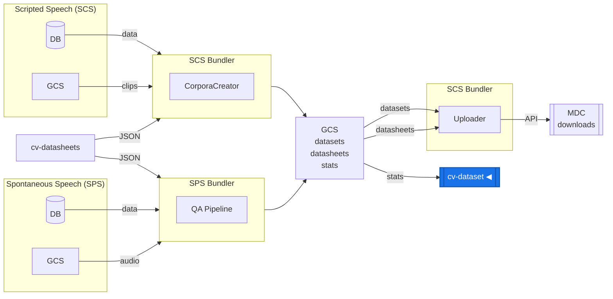

# Common Voice Datasets

This repo contains release details and metadata for the [Common Voice](https://commonvoice.mozilla.org) datasets. Please visit the [Mozilla Data Collective Common Voice section](https://datacollective.mozillafoundation.org/organization/cmfh0j9o10006ns07jq45h7xk) to download the latest datasets.

## Dataset Types

Common Voice collects voice data through multiple modalities. Each dataset type has its own release information, data structure, and documentation.

| Type                                               | Alias | Status  | Releases | Latest (2026-03) | Languages |
| -------------------------------------------------- | ----- | ------- | -------: | :--------------: | --------: |
| [Scripted Speech](datasets/scripted-speech/)       | SCS   | Active  |       25 |      v25.0       |       290 |
| [Spontaneous Speech](datasets/spontaneous-speech/) | SPS   | Active  |        3 |       v3.0       |        72 |
| [Code Switching](datasets/code-switching/)         | CS    | Planned |       -- |        --        |        -- |

See each dataset type's documentation for detailed information about data structures, fields in metadata files (`.tsv`), archive contents, and release changelogs. Note that the "date" in releases represents the cut-off date for data collection and validation, not the actual release date of the dataset.

## Data Pipeline



## Overview

### Scripted Speech (SCS)

```mermaid
---
config:
    xyChart:
        width: 900
        height: 400
---
xychart-beta
    title "Scripted Speech: Total & Validated Hours"
    x-axis ["1","2","3","4","5.1","6.1","7","8","9","10","11","12","13","14","15","16.1","17","18","19","20","21","22","23","24","25"]
    y-axis "Hours" 0 --> 42000
    bar [1368,2366,2454,4257,7226,9283,13905,18243,20217,20817,24231,26119,27141,28117,28750,30328,31175,32121,32584,33154,33534,33815,35921,38932,41792]
    bar [1096,1872,1979,3401,5671,7335,11192,14122,14973,15234,16429,17127,17689,18651,19159,19915,20408,20943,21593,22106,22344,22640,24600,25886,28377]
```



For details see: [Scripted Speech documentation](datasets/scripted-speech/)

### Spontaneous Speech (SPS)

```mermaid
---
config:
    xyChart:
        width: 600
        height: 350
---
xychart-beta
    title "Spontaneous Speech: Total vs Validated Hours"
    x-axis ["v1.0","v2.0","v3.0"]
    y-axis "Hours" 0 --> 600
    bar [428,454,508]
    bar [263,268,269]
```



For details see: [Spontaneous Speech documentation](datasets/spontaneous-speech/)

## Dataset Access

You can download the Common Voice datasets from the [Mozilla Data Collective](https://datacollective.mozillafoundation.org/) (MDC) platform:

- [Directly from the browser](https://datacollective.mozillafoundation.org/organization/cmfh0j9o10006ns07jq45h7xk)
- [Using the MDC API](https://datacollective.mozillafoundation.org/api-reference)
- [Using the MDC Python SDK](https://github.com/Mozilla-Data-Collective/datacollective-python) to directly load the datasets as pandas DataFrame in your Python codebase

## Generating Dataset Statistics

Helper scripts are available in the [helpers/](helpers/) directory for processing bundler output into dataset statistics. See [helpers/README.md](helpers/README.md) for detailed usage and examples.

All helper scripts support multiple dataset types via the first argument:

```bash
node helpers/createStats.js <dataset-type> <stats-folder>
node helpers/compareReleases.js <dataset-type> <dataset-1> <dataset-2>
node helpers/createDeltaStatistics.js <dataset-type> <dataset-1> <dataset-2>
node helpers/recalculateStats.js <dataset-type> <dataset>
```

## Citation

If you use the data in a published academic work we would appreciate if you cite the following article:

- Ardila, R., Branson, M., Davis, K., Henretty, M., Kohler, M., Meyer, J., Morais, R., Saunders, L., Tyers, F. M. and Weber, G. (2020) "[Common Voice: A Massively-Multilingual Speech Corpus](https://arxiv.org/abs/1912.06670)". _Proceedings of the 12th Conference on Language Resources and Evaluation (LREC 2020)._ pp. 4211--4215

```bibtex
@inproceedings{commonvoice:2020,
  author = {Ardila, R. and Branson, M. and Davis, K. and Henretty, M. and Kohler, M. and Meyer, J. and Morais, R. and Saunders, L. and Tyers, F. M. and Weber, G.},
  title = {Common Voice: A Massively-Multilingual Speech Corpus},
  booktitle = {Proceedings of the 12th Conference on Language Resources and Evaluation (LREC 2020)},
  pages = {4211--4215},
  year = 2020
}
```

## Feedback

Please only use this repo to provide feedback on **technical issues** with the dataset, such as file corruptions, problems with the partitions, and so on. For more expansive discussions, please join us in [Discourse](https://discourse.mozilla.org/c/voice) or [Matrix](https://chat.mozilla.org/#/room/#common-voice:mozilla.org).
