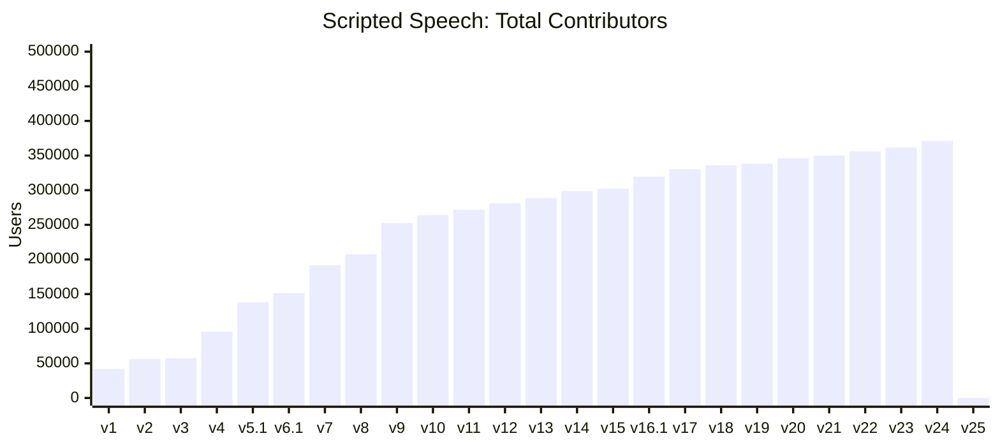
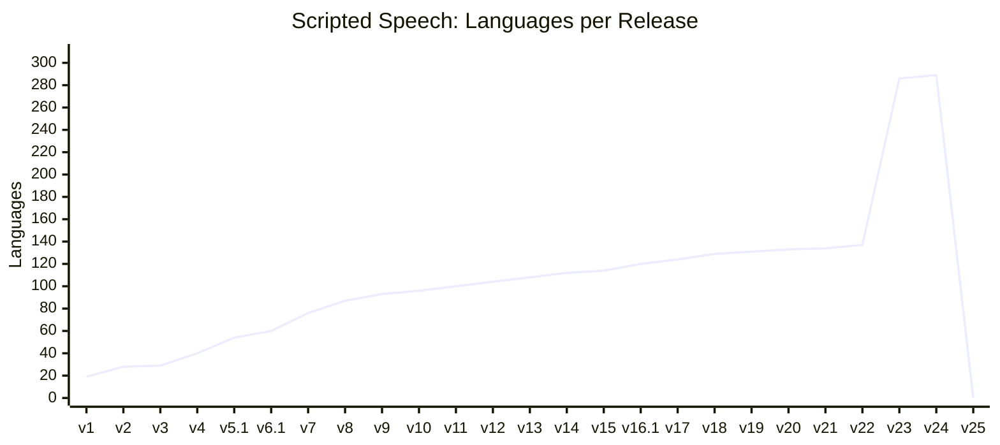

# Scripted Speech (SCS)

Scripted Speech is the classic Common Voice dataset. Contributors read pre-written sentences aloud, and the community validates the recordings. New datasets are released approximately every quarter.

All voice contributions are released as part of datasets, regardless of validation status. We only remove clips from datasets at the request of the user. The clips are currently bundled using the embedded bundler in the public repo [Common Voice - Bundler](https://github.com/common-voice/common-voice/tree/main/bundler).

## Release History

See the full [Changelog](CHANGELOG.md) for detailed release notes and new languages per release.

### Total and Validated Hours

```mermaid
---
config:
    xyChart:
        width: 900
        height: 400
---
xychart-beta
    title "Scripted Speech: Total vs Validated Hours"
    x-axis ["v1","v2","v3","v4","v5.1","v6.1","v7","v8","v9","v10","v11","v12","v13","v14","v15","v16.1","v17","v18","v19","v20","v21","v22","v23","v24","v25"]
    y-axis "Hours" 0 --> 42000
    bar [1368,2366,2454,4257,7226,9283,13905,18243,20217,20817,24231,26119,27141,28117,28750,30328,31175,32121,32584,33154,33534,33815,35921,38932,0]
    bar [1096,1872,1979,3401,5671,7335,11192,14122,14973,15234,16429,17127,17689,18651,19159,19915,20408,20943,21593,22106,22344,22640,24600,25886,0]
```



### Contributors



_Counts are summed per language — contributors active in multiple languages are counted once per language._

### Language Count



## About the Statistics

Statistics for each release are stored as JSON files in this directory. The JSON structure may have changed slightly from release to release, so if you plan on doing any comparisons you may need to normalize them between versions.

Any demographic split (i.e. gender, age, accent) is applied to **the entire dataset**, not just the validated set. Unless otherwise indicated, durations are measured in milliseconds, and file sizes are measured in bytes.

## Archive Structure

Each downloaded `.tar.gz` file has the following structure, where `{lang}` represents the [BCP 47](https://en.wikipedia.org/wiki/IETF_language_tag) locale code for that language:

```txt
cv-corpus-{version}-{YYYY-MM-DD}-{lang}.tar.gz/
  cv-corpus-{version}-{YYYY-MM-DD}/
  └── {lang}/
      ├── clips/
      │   └── *.mp3
      ├── dev.tsv
      ├── invalidated.tsv
      ├── other.tsv
      ├── test.tsv
      ├── train.tsv
      ├── validated.tsv
      ├── reported.tsv
      ├── clip_durations.tsv
      ├── validated_sentences.tsv
      └── unvalidated_sentences.tsv
```

## TSV Fields

Each row of a TSV file represents a single audio clip:

- `client_id` -- hashed UUID of a given user
- `path` -- relative path of the audio file
- `sentence` -- supposed transcription of the audio
- `sentence_id` -- unique identifier for the sentence (since Corpus 17.0)
- `sentence_domain` -- domain classification(s) of the sentence (since Corpus 17.0)
- `up_votes` -- number of people who said audio matches the text
- `down_votes` -- number of people who said audio does not match text
- `age` -- age bracket of the speaker\*
- `gender` -- gender of the speaker\*
- `accents` -- accents of the speaker\* (previously named `accent` but renamed to reflect multiple selections, since Corpus 17.0)
- `variant` -- language variant (since Corpus 13.0)
- `locale` -- locale code of the language (since Corpus 5.0)
- `segment` -- custom dataset segment, if applicable (since Corpus 5.0)

\*For a full list of age, gender, and accent options, see the [demographics spec](https://github.com/common-voice/common-voice/blob/main/web/src/stores/demographics.ts). These are only reported if the speaker opted in.

### Additional TSV Files

**`clip_durations.tsv`** (since Corpus 16.1) -- clip filename and duration:

- `filename` -- clip filename
- `duration[ms]` -- duration of the clip in milliseconds

**`validated_sentences.tsv`** (since Corpus 17.0) -- sentences that have reached the validated threshold (two or more up votes):

- `sentence_id` -- unique identifier for the sentence
- `sentence` -- text of the sentence
- `variant` -- language variant token for the sentence, if any (since Corpus 25.0)
- `sentence_domain` -- domain classification(s) of the sentence
- `source` -- origin of the sentence
- `is_used` -- whether the sentence has been used in a recording
- `clips_count` -- number of clips recorded for this sentence

**`unvalidated_sentences.tsv`** (since Corpus 17.0) -- sentences that have not reached the validated threshold or have been rejected:

- `sentence_id` -- unique identifier for the sentence
- `sentence` -- text of the sentence
- `variant` -- language variant token for the sentence, if any (since Corpus 25.0)
- `sentence_domain` -- domain classification(s) of the sentence
- `source` -- origin of the sentence (user provided or from old files under server/data)
- `up_votes` -- number of approving votes (since Corpus 25.0)
- `down_votes` -- number of rejecting votes (since Corpus 25.0)
- `status` -- `pending` (not yet decided) or `rejected` (2+ down votes exceeding up votes) (since Corpus 25.0)

### Validation Categories

- `validated` -- clips with two or more validations where `up_votes` > `down_votes`
- `invalidated` -- clips with two or more validations where `down_votes` > `up_votes`, or three or more where `down_votes` = `up_votes`
- `other` -- clips without sufficient validations to determine their status

Since Corpus 5.0, `reported.tsv` lists all sentences flagged by contributors for each language.

## Use for Machine Learning

We use the [Corpora Creator](https://github.com/common-voice/CorporaCreator) tool to parse through metadata to generate [train, dev, and test](https://en.wikipedia.org/wiki/Training,_validation,_and_test_sets) sets. The Corpora Creator eliminates duplication in clips and maximizes for speaker diversity.

Each train/dev/test set is generated non-deterministically, meaning they will vary from release to release even for minor updates. This is to avoid reproducing and perpetuating any demographic skews in each subsequent set.
Note that total clips in these sets will most probably not add up to the total validated clips because of this limitation. Please check the repo to include multiple recordings per sentence (the `-s` flag) if you want to get as close as possible to the total validated clips.
