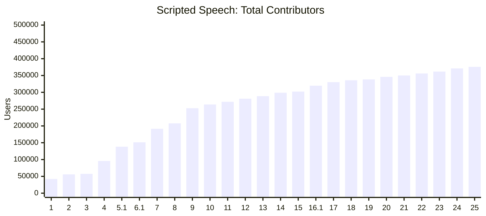
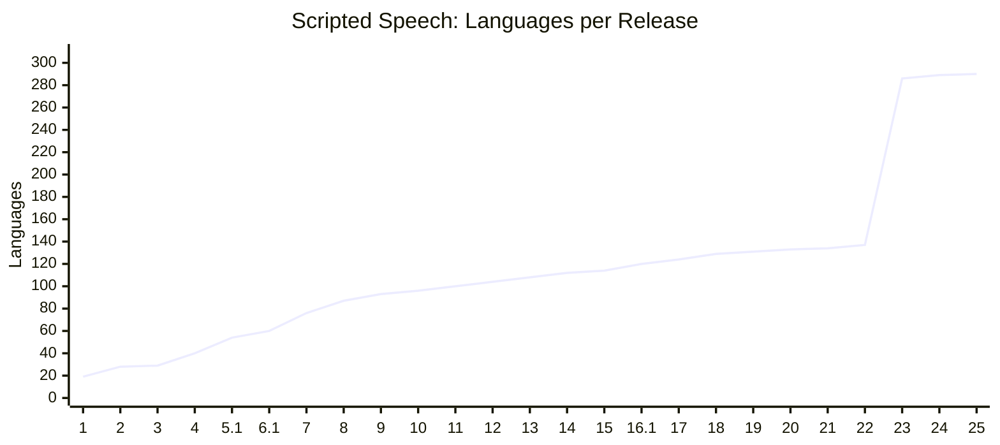

# Scripted Speech (SCS)

Scripted Speech is the classic Common Voice dataset. Contributors read pre-written sentences aloud, and the community validates the recordings. New datasets are released approximately every quarter.

All voice contributions are released as part of datasets, regardless of validation status. From v25.0 on, clips that fail quality checks (over-length, corrupted, or missing audio files) are excluded during bundling; a per-locale problem clip report is included with each release for transparency. The clips are currently bundled using the embedded bundler in the public repo [Common Voice - Bundler](https://github.com/common-voice/common-voice/tree/main/bundler).

## Release History

See the full [Changelog](CHANGELOG.md) for detailed release notes and new languages per release.

### Total and Validated Hours

```mermaid
---
config:
    xyChart:
        width: 900
        height: 400
---
xychart-beta
    title "Scripted Speech: Total & Validated Hours"
    x-axis ["1","2","3","4","5.1","6.1","7","8","9","10","11","12","13","14","15","16.1","17","18","19","20","21","22","23","24","25"]
    y-axis "Hours" 0 --> 42000
    bar [1368,2366,2454,4257,7226,9283,13905,18243,20217,20817,24231,26119,27141,28117,28750,30328,31175,32121,32584,33154,33534,33815,35921,38932,41792]
    bar [1096,1872,1979,3401,5671,7335,11192,14122,14973,15234,16429,17127,17689,18651,19159,19915,20408,20943,21593,22106,22344,22640,24600,25886,28377]
```



### Contributors



_Counts are summed per language — contributors active in multiple languages are counted once per language._

### Language Count



### Release Summary

<div align="center">

| Release | Date       | Languages | Total Hours | Validated Hours |
| ------- | ---------- | --------: | ----------: | --------------: |
| v1      | 2019-02-25 |        19 |       1,368 |           1,096 |
| v2      | 2019-06-11 |        28 |       2,366 |           1,872 |
| v3      | 2019-06-24 |        29 |       2,454 |           1,979 |
| v4      | 2019-12-10 |        40 |       4,257 |           3,401 |
| v5.1    | 2020-06-22 |        54 |       7,226 |           5,671 |
| v6.1    | 2020-12-11 |        60 |       9,283 |           7,335 |
| v7.0    | 2021-07-21 |        76 |      13,905 |          11,192 |
| v8.0    | 2022-01-19 |        87 |      18,243 |          14,122 |
| v9.0    | 2022-04-27 |        93 |      20,217 |          14,973 |
| v10.0   | 2022-07-04 |        96 |      20,817 |          15,234 |
| v11.0   | 2022-09-21 |       100 |      24,231 |          16,429 |
| v12.0   | 2022-12-07 |       104 |      26,119 |          17,127 |
| v13.0   | 2023-03-09 |       108 |      27,141 |          17,689 |
| v14.0   | 2023-06-23 |       112 |      28,117 |          18,651 |
| v15.0   | 2023-09-08 |       114 |      28,750 |          19,159 |
| v16.1   | 2023-12-06 |       120 |      30,328 |          19,915 |
| v17.0   | 2024-03-15 |       124 |      31,175 |          20,408 |
| v18.0   | 2024-06-14 |       129 |      32,121 |          20,943 |
| v19.0   | 2024-09-13 |       131 |      32,584 |          21,593 |
| v20.0   | 2024-12-06 |       133 |      33,154 |          22,106 |
| v21.0   | 2025-03-14 |       134 |      33,534 |          22,344 |
| v22.0   | 2025-06-20 |       137 |      33,815 |          22,640 |
| v23.0   | 2025-09-05 |       286 |      35,921 |          24,600 |
| v24.0   | 2025-12-05 |       289 |      38,932 |          25,886 |
| v25.0   | 2026-03-09 |       290 |      41,792 |          28,377 |

</div>

## About the Statistics

Statistics for each release are stored as JSON files in this directory. The JSON structure may have changed slightly from release to release, so if you plan on doing any comparisons you may need to normalize them between versions.

Any demographic split (i.e. gender, age, accent) is applied to **the entire dataset**, not just the validated set. Unless otherwise indicated, durations are measured in milliseconds, and file sizes are measured in bytes.

## Archive Structure

Each downloaded `.tar.gz` file has the following structure, where `{lang}` represents the [BCP 47](https://en.wikipedia.org/wiki/IETF_language_tag) locale code for that language:

```txt
cv-corpus-{version}-{YYYY-MM-DD}-{lang}.tar.gz/
  cv-corpus-{version}-{YYYY-MM-DD}/
  └── {lang}/
      ├── README.md                (datasheet, since Corpus 25.0)
      ├── clips/
      │   └── *.mp3
      ├── dev.tsv
      ├── invalidated.tsv
      ├── other.tsv
      ├── test.tsv
      ├── train.tsv
      ├── validated.tsv
      ├── reported.tsv
      ├── clip_durations.tsv
      ├── validated_sentences.tsv
      └── unvalidated_sentences.tsv
```

## TSV Fields

Each row of a clip TSV file (`validated.tsv`, `invalidated.tsv`, `other.tsv`, `train.tsv`, `dev.tsv`, `test.tsv`) represents a single audio clip:

- `client_id` -- hashed UUID of a given user
- `path` -- relative path of the audio file
- `sentence` -- transcription of the audio to be read aloud by the contributor
- `sentence_id` -- unique identifier for the sentence (since Corpus 17.0)
- `sentence_domain` -- domain classification(s) of the sentence (since Corpus 17.0)
- `up_votes` -- number of people who said audio matches the sentence
- `down_votes` -- number of people who said audio does not match the sentence
- `age` -- age bracket of the speaker - if provided\*
- `gender` -- gender of the speaker - if provided\*
- `accents` -- accent(s) of the speaker - if provided\* (previously named `accent` but renamed to reflect multiple selections, since Corpus 17.0)
- `variant` -- language variant - if provided (since Corpus 13.0)
- `locale` -- locale code of the language (since Corpus 5.0)
- `segment` -- custom dataset segment, if applicable (since Corpus 5.0)

The `train.tsv`, `dev.tsv`, and `test.tsv` splits are produced by [CorporaCreator](https://github.com/common-voice/CorporaCreator) and contain the same columns as `validated.tsv`.

\*For a full list of age, gender, and accent options, see the [demographics spec](https://github.com/common-voice/common-voice/blob/main/web/src/stores/demographics.ts). These are only reported if the speaker opted in.

### Additional TSV Files

**`clip_durations.tsv`** (since Corpus 16.1) -- clip filename and duration:

- `clip` -- clip filename
- `duration[ms]` -- duration of the clip in milliseconds

**`validated_sentences.tsv`** (since Corpus 17.0) -- sentences that have reached the validated threshold (two or more up votes):

- `sentence_id` -- unique identifier for the sentence
- `sentence` -- the sentence itself
- `variant` -- language variant token for the sentence, if provided (since Corpus 25.0)
- `sentence_domain` -- domain classification(s) of the sentence, if provided
- `source` -- origin of the sentence (user provided or from old files under server/data)
- `is_used` -- whether the sentence is still eligible for recording (sentences may be retired if they are incorrect, outdated, too similar to other sentences, or for other reasons via database migrations)
- `clips_count` -- number of clips recorded for this sentence

**`unvalidated_sentences.tsv`** (since Corpus 17.0) -- sentences that have not reached the validated threshold or have been rejected:

- `sentence_id` -- unique identifier for the sentence
- `sentence` -- the sentence itself
- `variant` -- language variant token for the sentence, if provided (since Corpus 25.0)
- `sentence_domain` -- domain classification(s) of the sentence, if provided
- `source` -- origin of the sentence (user provided or from old files under server/data)
- `up_votes` -- number of approving votes (since Corpus 25.0)
- `down_votes` -- number of rejecting votes (since Corpus 25.0)
- `status` -- `pending` (not yet decided) or `rejected` (2+ down votes exceeding up votes) (since Corpus 25.0)

### Validation Categories

- `validated` -- clips with two or more validations where `up_votes` > `down_votes`
- `invalidated` -- clips with two or more validations where `down_votes` > `up_votes`, or three or more where `down_votes` = `up_votes`
- `other` -- clips without sufficient validations to determine their status

**`reported.tsv`** (since Corpus 5.0) -- sentences flagged by contributors:

- `sentence` -- text of the reported sentence
- `sentence_id` -- unique identifier for the sentence
- `locale` -- locale code
- `reason` -- report reason: `offensive-language`, `grammar-or-spelling`, `different-language`, `difficult-pronounce`

Note: reporting a sentence does not remove it from circulation. Reported sentences remain available for recording and validation. The `reported.tsv` file is provided for post-processing by dataset consumers.

## Use for Machine Learning

We use the [Corpora Creator](https://github.com/common-voice/CorporaCreator) tool to parse through metadata to generate [train, dev, and test](https://en.wikipedia.org/wiki/Training,_validation,_and_test_sets) sets. The Corpora Creator eliminates duplication in clips and maximizes for speaker diversity.

Each train/dev/test set is generated non-deterministically, meaning they will vary from release to release even for minor updates. This is to avoid reproducing and perpetuating any demographic skews in each subsequent set.
Note that total clips in these sets will most probably not add up to the total validated clips because of this limitation. Please check the repo to include multiple recordings per sentence (the `-s` flag) if you want to get as close as possible to the total validated clips.
