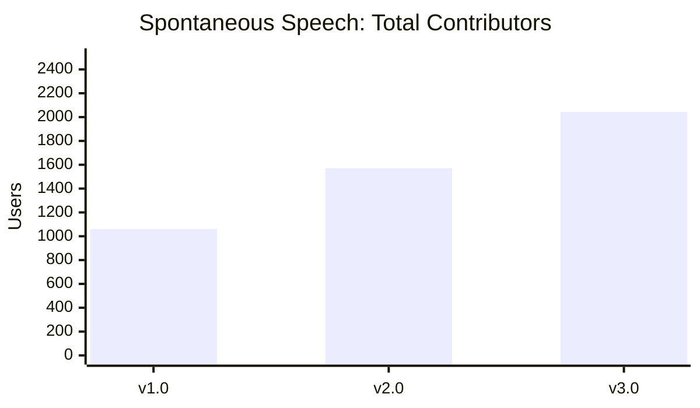
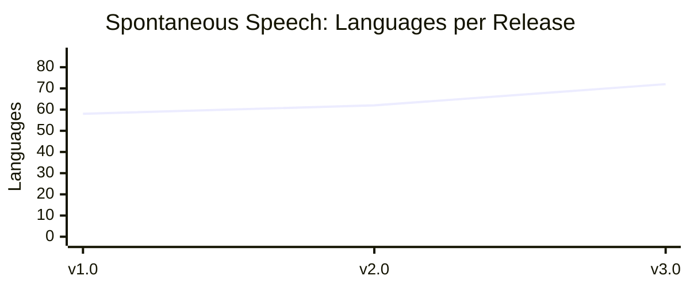

# Spontaneous Speech (SPS)

Spontaneous Speech is a newer Common Voice modality where contributors respond to open-ended questions in their own words, producing natural, unscripted audio. The community validates recordings and transcriptions. Releases are produced using the SPS Bundler.

All audio contributions are released under the [CC-0 license](https://creativecommons.org/publicdomain/zero/1.0/). Clips are only removed at the request of the contributor, and problematic content flagged by the community via Report button are also excluded from the datasets.

## Release History

See the full [Changelog](CHANGELOG.md) for detailed release notes and new languages per release.

### Total and Validated Hours

```mermaid
---
config:
    xyChart:
        width: 600
        height: 350
---
xychart-beta
    title "Spontaneous Speech: Total vs Validated Hours"
    x-axis ["v1.0","v2.0","v3.0"]
    y-axis "Hours" 0 --> 600
    bar [428,454,508]
    bar [263,268,269]
```



### Contributors



### Language Count



## About the Statistics

Statistics for each release are stored as JSON files in this directory. Durations are measured in milliseconds and file sizes in bytes unless otherwise noted.

Key differences from Scripted Speech statistics:

- Demographics are under a `demographics` object (not `splits`)
- Duration is a nested object with `total_ms`, `validated_ms`, `avg_ms`, etc.
- Buckets (`train`/`dev`/`test`) include per-bucket `clips`, `users`, `duration_ms`, `duration_hrs`
- SPS-specific fields: `questions`, `audios`, `transcriptions`, `reported.reasons`

## Archive Structure

Each release produces a full data archive per locale. Naming: `sps-corpus-{version}-{YYYY-MM-DD}-{locale}.tar.gz`

```txt
sps-corpus-{version}-{YYYY-MM-DD}-{locale}/
├── README.md                                (locale-specific datasheet)
├── audios/
│   └── spontaneous-speech-{locale}-*.mp3
├── ss-corpus-{locale}.tsv                   (main data file)
├── ss-reported-audios-{locale}.tsv          (reported/flagged audios)
└── ss-corpus-{locale}.qa-summary.json       (quality assurance summary)
```

## TSV Fields

### Main Data File: `ss-corpus-{locale}.tsv`

Each row represents a single audio recording:

- `client_id` -- hashed UUID of the speaker
- `audio_id` -- numeric identifier for the audio
- `audio_file` -- filename (e.g., `spontaneous-speech-en-1.mp3`)
- `duration_ms` -- audio duration in milliseconds
- `prompt_id` -- numeric identifier for the question/prompt
- `prompt` -- the question text asked to the speaker
- `transcription` -- transcription of the speaker's response (may contain `[disfluency]`, `[noise]`, etc. tags)
- `votes` -- number of validation votes received
- `age` -- age bracket of the speaker\*
- `gender` -- gender of the speaker\*
- `accents` -- accent codes (comma-separated)
- `variant` -- language variant codes of the speaker
- `language` -- language name
- `prompt_upvotes` -- number of upvotes on the prompt
- `prompt_reports` -- number of reports on the prompt
- `is_edited` -- `0` or `1`, indicates if transcription was edited
- `split` -- dataset partition: `train`, `dev`, `test`, or `unassigned`
- `char_per_sec` -- characters per second of transcription relative to audio duration
- `quality_tags` -- pipe-separated quality flags (e.g., `transcription-length|speech-rate|short-audio|long-audio`)

\*For a full list of age and gender options, see the [demographics spec](https://github.com/common-voice/spontaneous-speech/blob/main/web/src/stores/demographics.ts). These are only reported if the speaker opted in.

### Reported Audios File: `ss-reported-audios-{locale}.tsv`

Each row represents a reported audio clip:

- `client_id` -- hashed UUID of the reporter
- `audio_id` -- numeric identifier
- `audio_file` -- filename
- `duration_ms` -- audio duration
- `prompt_id` -- prompt identifier
- `prompt` -- prompt text
- `reason` -- report reason: `other`, `different_language`, `personally_identifiable_information`, `offensive_speech`
- `comment` -- free-text comment from the reporter
- `language` -- language name

### QA Summary File: `ss-corpus-{locale}.qa-summary.json`

Quality assurance metadata documenting the processing pipeline:

- Whether disfluency markers were applied to transcriptions
- How many rows were affected by each processing step
- Quality tagging results and problem clip counts

## Validation and Transcription Categories

SPS audio goes through a multi-stage pipeline:

1. **Recording** -- contributors answer questions spontaneously
2. **Transcription** -- community members transcribe the audio
3. **Validation** -- transcriptions are reviewed, possibly edited, and validated

Audio status categories in statistics:

- `transcribed_validated` -- audio with reviewed and accepted transcriptions
- `transcribed_pending` -- audio transcribed but not yet validated
- `not_transcribed` -- audio without any transcription yet

Dataset split (`train`/`dev`/`test`) is assigned only to validated audio. Unvalidated audio has this field blank.
