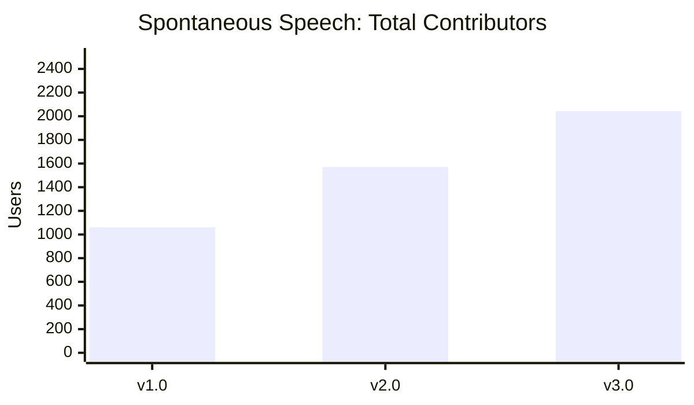
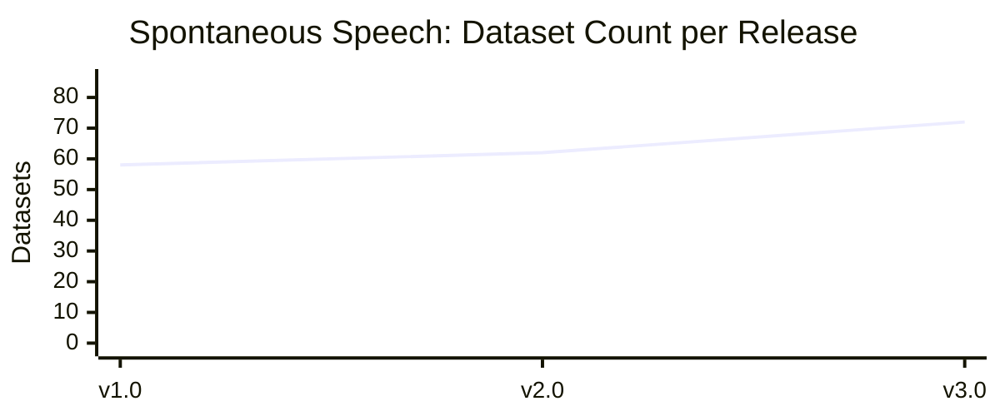

# Spontaneous Speech (SPS)

Spontaneous Speech is a newer Common Voice modality where contributors respond to open-ended questions in their own words, producing natural, unscripted audio. The community validates recordings, transcribes the audio, and reviews the transcriptions. Releases are produced using the SPS Bundler.

All audio contributions are released under the [CC-0 license](https://creativecommons.org/publicdomain/zero/1.0/). Clips are only removed at the request of the contributor, and problematic content flagged by the community via the Report button is also excluded from the datasets.

## Release History

See the full [Changelog](CHANGELOG.md) for detailed release notes and new languages per release.

### Total and Validated Hours

```mermaid
---
config:
    xyChart:
        width: 600
        height: 350
---
xychart-beta
    title "Spontaneous Speech: Total vs Validated Hours"
    x-axis ["v1.0","v2.0","v3.0"]
    y-axis "Hours" 0 --> 600
    bar [428,454,508]
    bar [263,268,269]
```



### Contributors



### Dataset Count



### Release Summary

<div align="center">

| Release | Date       | Languages | Total Hours | Validated Hours |
| ------- | ---------- | --------: | ----------: | --------------: |
| v1.0    | 2025-09-05 |        58 |         428 |             263 |
| v2.0    | 2025-12-05 |        62 |         454 |             268 |
| v3.0    | 2026-03-09 |        72 |         508 |             269 |

</div>

## About the Statistics

Statistics for each release are stored as JSON files in this directory. Durations are measured in milliseconds and file sizes in bytes unless otherwise noted.

Key differences from Scripted Speech statistics:

- Demographics are under a `demographics` object (not `splits`)
- Duration is a nested object with `total_ms`, `validated_ms`, `avg_ms`, etc.
- Buckets (`train`/`dev`/`test`) include per-bucket `clips`, `users`, `duration_ms`, `duration_hrs`
- SPS-specific fields: `questions`, `audios`, `transcriptions`, `reported.reasons`

## Archive Structure

Each release produces a full data archive per locale. Naming: `sps-corpus-{version}-{YYYY-MM-DD}-{locale}.tar.gz`

```txt
sps-corpus-{version}-{YYYY-MM-DD}-{locale}/
├── README.md                                (locale-specific datasheet)
├── audios/
│   └── spontaneous-speech-{locale}-*.mp3
├── ss-corpus-{locale}.tsv                   (main data file)
├── ss-reported-audios-{locale}.tsv          (reported/flagged audios)
└── ss-corpus-{locale}.qa-summary.json       (quality assurance summary)
```

## TSV Fields

### Main Data File: `ss-corpus-{locale}.tsv`

Each row represents a single audio recording:

- `client_id` -- hashed UUID of the speaker
- `audio_id` -- numeric identifier for the audio
- `audio_file` -- filename (e.g., `spontaneous-speech-en-1.mp3`)
- `duration_ms` -- audio duration in milliseconds
- `prompt_id` -- numeric identifier for the question/prompt
- `prompt` -- the question text asked to the speaker
- `transcription` -- transcription of the speaker's response (may contain `[disfluency]`, `[noise]`, etc. tags)
- `votes` -- number of validation votes received
- `age` -- age bracket of the speaker\* (since v3.0, cross-referenced from SCS profiles when available)
- `gender` -- gender of the speaker\* (since v3.0, cross-referenced from SCS profiles when available)
- `accents` -- accent codes (comma-separated; since v3.0, cross-referenced from SCS profiles when available)
- `variant` -- language variant codes of the speaker (since v3.0, cross-referenced from SCS profiles when available)
- `language` -- language name
- `prompt_upvotes` -- number of upvotes on the prompt
- `prompt_reports` -- number of reports on the prompt
- `is_edited` -- `0` or `1`, indicates if transcription was edited
- `split` -- dataset partition: `train`, `dev`, `test`, or `unassigned`
- `char_per_sec` -- characters per second of transcription relative to audio duration
- `quality_tags` -- pipe-separated quality flags applied during post-processing (see [Quality Tags](#quality-tags) below)

\*For a full list of age and gender options, see the [demographics spec](https://github.com/common-voice/spontaneous-speech/blob/main/web/src/stores/demographics.ts). These are only reported if the speaker opted in.

### Reported Audios File: `ss-reported-audios-{locale}.tsv`

Each row represents a reported audio clip:

- `client_id` -- hashed UUID of the reporter
- `audio_id` -- numeric identifier
- `audio_file` -- filename
- `duration_ms` -- audio duration
- `prompt_id` -- prompt identifier
- `prompt` -- prompt text
- `reason` -- report reason: `other`, `different_language`, `personally_identifiable_information`, `offensive_speech`
- `comment` -- free-text comment from the reporter
- `language` -- language name

Note: reported audios (regardless of reason) are excluded from the main corpus TSV. However, their metadata and audio files are still present in the release archive under `ss-reported-audios-{locale}.tsv` and `audios/`. `personally_identifiable_information` reports will be excluded in the following releases.

### QA Summary File: `ss-corpus-{locale}.qa-summary.json`

Quality assurance metadata documenting the processing pipeline:

- Whether disfluency markers were applied to transcriptions
- How many rows were affected by each processing step
- Quality tagging results and problem clip counts

### Quality Tags

The `quality_tags` field contains pipe-separated flags assigned during the post-processing QA step. A clip may have zero, one, or multiple tags. Tags are informational and do not exclude clips from the dataset.

#### Audio duration tags

| Tag           | Condition             | Description                     |
| ------------- | --------------------- | ------------------------------- |
| `short-audio` | duration < 2,000 ms   | Audio is shorter than 2 seconds |
| `long-audio`  | duration > 300,000 ms | Audio is longer than 5 minutes  |

#### Transcription quality tags

| Tag                    | Condition        | Description                                                 |
| ---------------------- | ---------------- | ----------------------------------------------------------- |
| `transcription-length` | chars/sec < 3.0  | Transcription is unusually short relative to audio duration |
| `speech-rate`          | chars/sec > 30.0 | Transcription is unusually long relative to audio duration  |

#### Script and language tags

| Tag                               | Description                                                               |
| --------------------------------- | ------------------------------------------------------------------------- |
| `non-allowed-script`              | Transcription uses a writing system not in the language's allowed scripts |
| `mixed-script-words`              | A single word/token contains characters from multiple writing systems     |
| `mixed-script-transcription`      | Transcription contains tokens from multiple writing systems               |
| `dataset-language-audio-mismatch` | Audio language verification did not match the expected dataset language   |

## Data Pipeline

SPS data goes through a multi-stage community pipeline:

1. **Question submission** -- community members submit open-ended prompts/questions
2. **Question validation** -- questions are upvoted or reported by the community
3. **Recording** -- contributors answer validated questions spontaneously
4. **Transcription** -- community members transcribe the audio
5. **Transcription validation** -- transcriptions are reviewed, possibly edited, and accepted when ready

### Question status categories in statistics (`questions`)

- `validated` -- questions accepted by the community (sufficient upvotes)
- `invalidated` -- questions rejected (reported or downvoted)
- `other` -- questions not yet fully validated
- `has_audio` -- questions that have at least one recording
- `avg_recordings_per_question` -- average number of audio recordings per question

### Audio status categories in statistics (`audios`)

- `transcribed_validated` -- audio with reviewed and accepted transcriptions
- `transcribed_pending` -- audio transcribed but not yet validated
- `not_transcribed` -- audio without any transcription yet

### Transcription status categories in statistics (`transcriptions`)

- `validated` -- transcriptions that have been reviewed and accepted
- `not_yet_validated` -- transcriptions awaiting review
- `edited` -- transcriptions that were modified during validation
- `edited_pct` -- percentage of transcriptions that were edited

Dataset split (`train`/`dev`/`test`) is assigned only to audio with validated transcriptions. Other audio has the `split` field set to `unassigned`.
